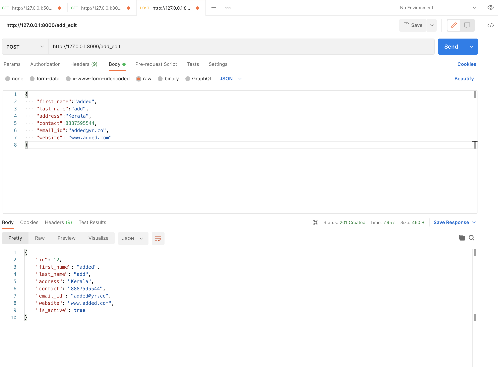
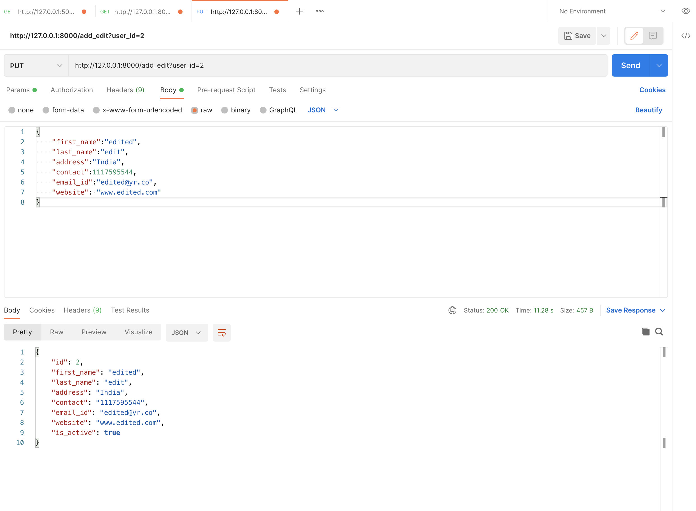
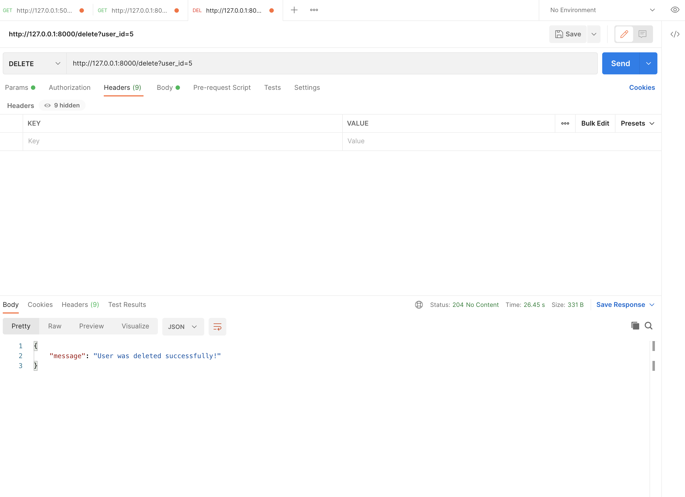
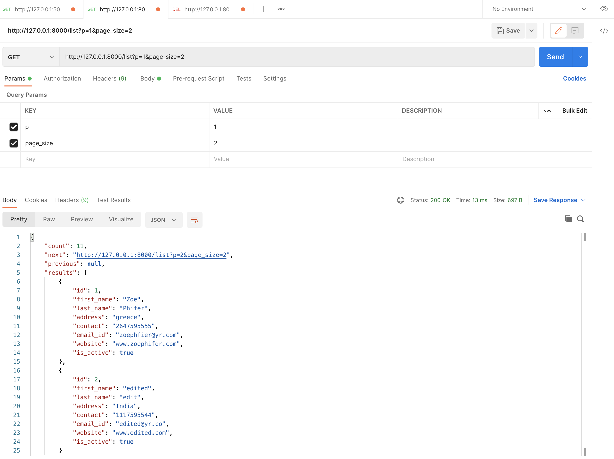
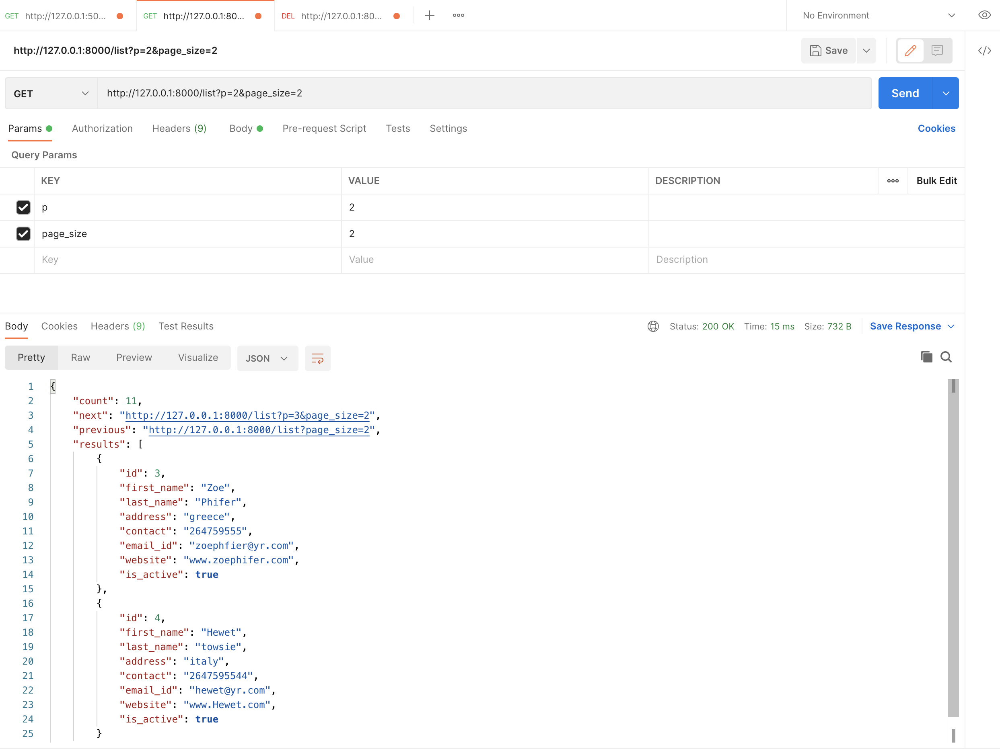

### Setup

Follow the steps to create the virtualenv.

Now, install the python dependencies via below command:

`pip install -r $API_SRC/requirements.txt`

### Loading data fixtures (optional)
Project already has db.sqlite3 committed for testing purpose. Data also can be loaded with below fixtures.

Use the Django loaddata feature to load the already created data for reference.

`python manage.py loaddata users/fixtures/DUser.json --app users.DUser`

### Tested on Postman
Django Rest framework endpoints testing screen shots:

- **Adding a user** (/add_edit)

- **Editing a user** (/add_edit)

- **Deleting a user** (/delete)

- **Fetch first page (pagination)** (/list)

- **Fetch second page (pagination)** (/list)

